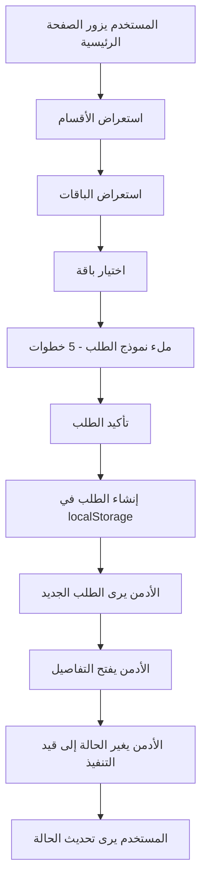
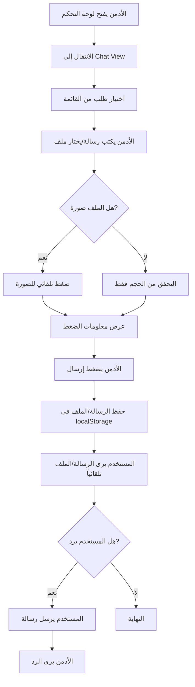
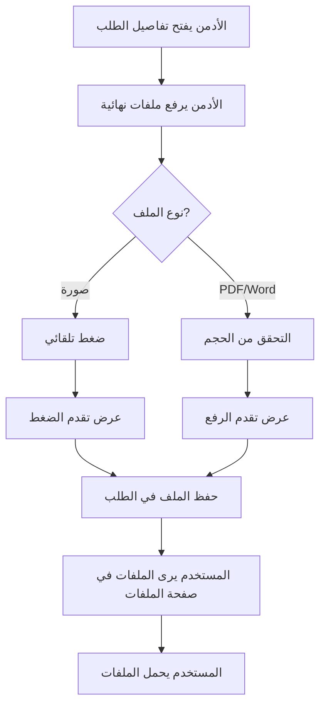

# تقرير شامل كامل - منصة معمار الرقمية

## جدول المحتويات

1. [مقدمة المشروع](#مقدمة-المشروع)
2. [التقنيات والبنية التحتية](#التقنيات-والبنية-التحتية)
3. [نظام الألوان والتصميم](#نظام-الألوان-والتصميم)
4. [النصوص والترجمة](#النصوص-والترجمة)
5. [الصفحة الرئيسية](#الصفحة-الرئيسية)
6. [واجهة المستخدم (Client Interface)](#واجهة-المستخدم-client-interface)
7. [واجهة الأدمن (Admin Interface)](#واجهة-الأدمن-admin-interface)
8. [سير العمل (Workflow)](#سير-العمل-workflow)
9. [الـ APIs والعمليات](#ال-apis-والعمليات)
10. [الجداول المرجعية](#الجداول-المرجعية)

---

## مقدمة المشروع

### نظرة عامة

**منصة معمار الرقمية** هو تطبيق PWA (Progressive Web App) متقدم يركز على التصميم للموبايل (Mobile-First) يربط العملاء بالمهندس لإدارة الطلبات الهندسية مع نظام دردشة متكامل.

### الهدف

- ربط العملاء بالمهندس (Manal) في بيئة رقمية آمنة
- أتمتة رحلة العميل من إنشاء الطلب إلى استلام المخططات النهائية
- توفير واجهة سهلة الاستخدام للعملاء ولوحة تحكم شاملة للمهندس
- دعم اللغة العربية والإنجليزية مع تبديل سلس
- دعم الثيم الليلي/النهاري

### الحالة الحالية

المشروع حالياً يعمل باستخدام `localStorage` كحل تخزين مؤقت (Mock Backend). يمكن الترقية لاحقاً إلى قاعدة بيانات حقيقية مثل Firebase أو أي حل Backend آخر.

---

## التقنيات والبنية التحتية

### التقنيات الأساسية

#### Frontend Framework
- **Next.js**: `^14.2.0` (App Router)
- **React**: `^18.3.0`
- **TypeScript**: `^5.5.0`
- **Tailwind CSS**: `^3.4.6`

#### Internationalization
- **next-intl**: `^3.15.0` - لإدارة اللغات والترجمة

#### Forms & Validation
- **react-hook-form**: `^7.51.0` - لإدارة النماذج
- **zod**: `^3.23.0` - للتحقق من صحة البيانات
- **@hookform/resolvers**: `^3.3.4` - ربط zod مع react-hook-form

#### UI Libraries
- **lucide-react**: `^0.378.0` - مكتبة الأيقونات
- **clsx**: `^2.1.1` - دمج classes
- **tailwind-merge**: `^2.4.0` - دمج Tailwind classes

#### Storage (حالياً)
- **localStorage** - حل مؤقت للتخزين
- يمكن الترقية إلى Firebase/Backend لاحقاً

### هيكل المشروع

```
src/
├── app/                    # Next.js App Router
│   ├── [locale]/          # صفحات محلية مع دعم i18n
│   │   ├── (auth)/        # صفحات المصادقة
│   │   │   ├── login/
│   │   │   └── signup/
│   │   ├── (client)/      # صفحات العميل
│   │   │   ├── account/
│   │   │   ├── chat/
│   │   │   ├── order/
│   │   │   └── packages/
│   │   ├── (admin)/       # لوحة تحكم المهندس
│   │   │   └── admin/dashboard/
│   │   ├── layout.tsx
│   │   └── page.tsx       # الصفحة الرئيسية
│   ├── globals.css
│   └── layout.tsx         # Layout الرئيسي
├── components/
│   ├── ui/                # مكونات UI أساسية
│   │   ├── Button.tsx
│   │   ├── Input.tsx
│   │   ├── Textarea.tsx
│   │   ├── Select.tsx
│   │   ├── Card.tsx
│   │   ├── ErrorDisplay.tsx
│   │   ├── LanguageToggle.tsx
│   │   └── ThemeToggle.tsx
│   ├── forms/             # مكونات النماذج
│   │   └── OrderForm.tsx
│   ├── chat/              # مكونات الدردشة
│   │   ├── ChatInterface.tsx
│   │   └── OrderSelector.tsx
│   ├── admin/             # مكونات لوحة التحكم
│   │   ├── AdminDashboard.tsx
│   │   ├── AdminChatPanel.tsx
│   │   ├── OrderDetails.tsx
│   │   └── OrderList.tsx
│   ├── account/           # مكونات الحساب
│   │   ├── ProfileSection.tsx
│   │   └── OrdersList.tsx
│   ├── auth/              # مكونات المصادقة
│   │   └── ProtectedRoute.tsx
│   ├── layout/            # مكونات التخطيط
│   │   └── Header.tsx
│   └── security/          # نظام الحماية
│       └── DownloadGate.tsx
├── lib/
│   ├── storage.ts         # وظائف التخزين (localStorage)
│   ├── fileCompression.ts # ضغط الملفات
│   └── utils.ts           # وظائف مساعدة
├── contexts/              # React Contexts
│   ├── AuthContext.tsx
│   └── ThemeContext.tsx
├── types/                 # TypeScript types
│   └── order.ts
├── i18n/                  # إعدادات i18n
│   ├── navigation.ts
│   ├── routing.ts
│   └── i18n.ts
├── locales/               # ملفات الترجمة
│   ├── ar.json
│   └── en.json
└── middleware.ts          # Next.js middleware
```

---

## نظام الألوان والتصميم

### لوحة الألوان الكاملة

#### الألوان الأساسية (من الشعار)

| اللون | الكود HEX | الاستخدام |
|------|-----------|-----------|
| **Primary** | `#2D6A6A` | الأزرار الرئيسية، العناوين، العناصر الأساسية |
| **Accent** | `#50B8E7` | التمييزات، الإبرازات، العناصر التفاعلية |
| **Secondary** | `#4A5568` | النصوص الثانوية، التعبئة الثانوية |
| **Text Secondary** | `#718096` | النصوص المساعدة، التلميحات |

#### الألوان الديناميكية

| العنصر | Light Mode | Dark Mode |
|--------|------------|-----------|
| **Background** | `#ffffff` | `#0a0a0a` |
| **Foreground** | `#171717` | `#ededed` |

#### الألوان في Tailwind Config

```typescript
// tailwind.config.ts
colors: {
  primary: "#2D6A6A",
  accent: "#50B8E7",
  secondary: "#4A5568",
  "text-secondary": "#718096",
}
```

#### CSS Variables

```css
:root {
  --primary: #2D6A6A;
  --accent: #50B8E7;
  --secondary: #4A5568;
  --text-secondary: #718096;
  --background: #ffffff;
  --foreground: #171717;
}

@media (prefers-color-scheme: dark) {
  :root {
    --background: #0a0a0a;
    --foreground: #ededed;
  }
}
```

### المكونات UI

#### Button
- **Variants**: `primary`, `secondary`, `outline`, `ghost`
- **Sizes**: `sm`, `md`, `lg`
- **States**: `default`, `hover`, `focus`, `disabled`, `loading`

#### Input
- دعم `label` و `error` state
- دعم RTL/LTR
- Validation messages

#### Textarea
- دعم `label` و `error` state
- Auto-resize
- دعم RTL/LTR

#### Select
- قائمة منسدلة
- دعم RTL/LTR
- Custom styling

#### Card
- تأثير hover
- دعم Dark Mode
- Responsive padding

### الأنماط CSS المخصصة

#### Architectural Grid Pattern
```css
.architectural-grid {
  background-image: 
    linear-gradient(to right, rgba(45, 106, 106, 0.1) 1px, transparent 1px),
    linear-gradient(to bottom, rgba(45, 106, 106, 0.1) 1px, transparent 1px);
  background-size: 20px 20px;
}
```

#### Card Hover Effect
```css
.card-hover {
  transition: all 0.3s cubic-bezier(0.4, 0, 0.2, 1);
}

.card-hover:hover {
  transform: translateY(-4px);
  box-shadow: 0 20px 25px -5px rgba(0, 0, 0, 0.1);
}
```

#### Chat Message Animation
```css
@keyframes slideIn {
  from {
    opacity: 0;
    transform: translateY(10px);
  }
  to {
    opacity: 1;
    transform: translateY(0);
  }
}

.chat-message {
  animation: slideIn 0.3s ease-out;
}
```

#### File Upload Animation
```css
@keyframes pulse {
  0%, 100% { opacity: 1; }
  50% { opacity: 0.5; }
}

.upload-pulse {
  animation: pulse 2s cubic-bezier(0.4, 0, 0.6, 1) infinite;
}
```

#### Scrollbar Styling
```css
::-webkit-scrollbar {
  width: 8px;
  height: 8px;
}

::-webkit-scrollbar-thumb {
  background: rgba(45, 106, 106, 0.3);
  border-radius: 4px;
}
```

### Responsive Design

#### Breakpoints
- **sm**: 640px
- **md**: 768px
- **lg**: 1024px
- **xl**: 1280px

#### Mobile-First Approach
جميع التصاميم تبدأ من الموبايل ثم تتوسع للشاشات الأكبر.

### Dark Mode Support
- دعم كامل للثيم الليلي/النهاري
- تبديل سلس باستخدام `ThemeContext`
- الألوان تتكيف تلقائياً مع الثيم

---

## النصوص والترجمة

### الأقسام في ملفات الترجمة

#### `common` (16 مفتاح)
النصوص المشتركة المستخدمة في جميع أنحاء التطبيق:
- `welcome`, `loading`, `error`, `save`, `cancel`, `next`, `previous`, `submit`, `edit`, `delete`, `search`, `filter`, `close`

#### `auth` (8 مفاتيح)
نصوص المصادقة:
- `login`, `logout`, `signup`, `email`, `password`, `phone`, `name`, `forgotPassword`, `loginError`, `signupError`

#### `packages` (17 مفتاح)
نصوص الباقات:
- `title`, `basic`, `advanced`, `professional`, `select`, `features`, `orderNow`
- `basicDesc`, `advancedDesc`, `professionalDesc`
- `basicFeature1-4`, `advancedFeature1-5`, `professionalFeature1-7`

#### `order` (15 مفتاح)
نصوص الطلبات:
- `title`, `step1-5`, `customerName`, `customerEmail`, `customerPhone`
- `landArea`, `landLocation`, `landType`, `landTypeResidential/Commercial/Industrial/Mixed`
- `lifestyle`, `architecturalHobbies`, `review`, `confirm`, `createOrderError`

#### `orderForm` (15 مفتاح)
نصوص نموذج الطلب:
- `familySize`, `bedrooms`, `bathrooms`, `livingStyle`, `workFromHome`
- `hobbies`, `pets`, `parking`, `garden`
- `reviewTitle`, `nameLabel`, `emailLabel`, `phoneLabel`, `areaLabel`, `locationLabel`, `landTypeLabel`, `packageLabel`
- `notSet`, `userInfoNote`, `userInfoNoteNotLoggedIn`

#### `chat` (15 مفتاح)
نصوص الدردشة:
- `title`, `sendMessage`, `freeMessages`, `paymentRequired`, `buyPackage`, `oneTimeConsultation`
- `myOrders`, `newOrder`, `noOrders`, `selectOrderToChat`, `selectOrderFromList`, `backToList`
- `sendError`, `now`, `minutesAgo`, `hoursAgo`, `daysAgo`

#### `admin` (50+ مفتاح)
نصوص لوحة التحكم:
- `dashboard`, `orders`, `orderDetails`, `uploadFiles`, `status`
- `pending`, `inProgress`, `ready`, `completed`
- `uploading`, `uploadFile`, `openChat`, `viewChat`
- `customerName`, `customerEmail`, `customerPhone`, `packageType`, `landArea`, `landLocation`, `landType`, `lifestyle`, `architecturalHobbies`
- `file`, `selectOrderToView`, `updateStatusError`, `uploadError`, `deleteFileError`, `noOrders`
- `ordersCount`, `switchToChat`, `switchToOrders`
- `totalOrders`, `pendingOrders`, `inProgressOrders`, `completedOrders`
- `fileUpload`, `fileCompressing`, `fileCompressed`, `compressionSavings`
- `fileSize`, `originalSize`, `compressedSize`, `selectFile`, `dragDropFile`
- `fileTypeNotSupported`, `fileTooLarge`, `uploadSuccess`, `removeFile`, `downloadFile`

#### `header` (2 مفتاح)
نصوص الهيدر:
- `myAccount`, `dashboard`

#### `home` (43+ مفتاح)
نصوص الصفحة الرئيسية:
- **Hero**: `heroTitle`, `heroSubtitle`, `startDesign`, `examplePlan`, `planFeature1-3`
- **Problem**: `problemTitle`, `problem1Title/Desc`, `problem2Title/Desc`, `problem3Title/Desc`
- **What You Get**: `whatYouGetTitle`, `whatYouGet1-3Title/Desc`
- **How We Think**: `howWeThinkTitle`, `howWeThink1-4Title/Desc`
- **Why We Are Here**: `whyWeAreHereTitle`, `whyWeAreHere1-4Title/Desc`
- **Conclusion**: `conclusionText`, `learnDesignMethod`
- **Design Method**: `designMethodTitle`, `designMethodSubtitle`, `step1-5Title/Desc`
- **FAQ**: `faqTitle`, `faq1-5Question/Answer`

#### `account` (3 مفاتيح)
نصوص الحساب:
- `myAccount`, `myInfo`, `myOrders`

#### `profile` (7 مفاتيح)
نصوص الملف الشخصي:
- `myInfo`, `edit`, `save`, `cancel`, `name`, `email`, `phone`, `notSet`, `updateError`

#### `orders` (11 مفتاح)
نصوص قائمة الطلبات:
- `order`, `package`, `area`, `chat`, `noOrders`, `createNewOrder`
- `packageBasic`, `packageAdvanced`, `packageProfessional`
- `statusPending`, `statusInProgress`, `statusReady`, `statusCompleted`

#### `validation` (6 مفاتيح)
نصوص التحقق من البيانات:
- `validationError`, `invalidEmail`, `invalidPhone`, `invalidNumber`, `requiredField`, `minLength`, `minValue`

### اللغات المدعومة

- **العربية (ar)**: اللغة الافتراضية
- **الإنجليزية (en)**: اللغة الثانوية

### ملفات الترجمة

- `src/locales/ar.json` - الترجمة العربية
- `src/locales/en.json` - الترجمة الإنجليزية

---

## الصفحة الرئيسية

الصفحة الرئيسية (`/`) تحتوي على 8 أقسام رئيسية:

### 1. Hero Section

**المحتوى**:
- **العنوان الرئيسي**: "نحول احتياجاتك إلى مخطط معماري مدروس قبل البناء"
- **العنوان الفرعي**: "تصميم تخطيطي مبدئي مخصص حب أرضك وغط حياتك، بدون زيارة مكتب"
- **زر CTA**: "ابدأ تصميمك الآن" (يربط إلى `/order/new`)
- **مثال المخطط**: Card يحتوي على:
  - صورة placeholder (أيقونة Home)
  - قائمة بثلاث نقاط:
    - توزيع المساحات حسب نمط حياتك
    - استغلال أمثل للمساحة
    - تصميم مدروس قبل البناء

**الخصائص**:
- تصميم مركز
- Responsive (Mobile-First)
- دعم Dark Mode

### 2. Problem Section ("ليش كثير يندم بعد البناء؟")

**المحتوى**:
3 Cards بمشاكل معينة:

1. **توزيع لا يناسب نمط الحياة**
   - Border-left: أحمر
   - وصف: "تصميم لا يتناسب مع احتياجاتك اليومية وأسلوب معيشتك"

2. **مساحات مهدرة**
   - Border-left: برتقالي
   - وصف: "مساحات غير مستغلة بشكل صحيح تؤثر على كفاءة المنزل"

3. **قرارات متسرعة بدون تصور واضح**
   - Border-left: أصفر
   - وصف: "اتخاذ قرارات بناء بدون دراسة كافية وتصور واضح للنتيجة النهائية"

**الخصائص**:
- خلفية رمادية فاتحة (`bg-gray-50`)
- تصميم Cards مع أيقونات AlertCircle

### 3. What You Get Section ("ماذا متحصل عليه؟")

**المحتوى**:
3 Cards بفوائد:

1. **تحليل احتياجاتك** (أيقونة Brain)
   - وصف: "فهم عميق لاحتياجاتك وأسلوب حياتك"

2. **توزيع فراغات ذكي** (أيقونة Target)
   - وصف: "استغلال أمثل لكل مساحة في منزلك"

3. **تصور تخطيطي واضح قابل للتنفيذ** (أيقونة Lightbulb)
   - وصف: "مخطط واضح جاهز للتنفيذ مباشرة"

**الخصائص**:
- Grid layout (3 أعمدة على Desktop)
- تصميم Cards مع أيقونات ملونة

### 4. How We Think Section ("التفكير بطريقة هندسية لمشروعك (مخطط الفيلا)")

**المحتوى**:
4 Cards في Grid 2x2:

1. **نفهم خط حياتك** (أيقونة Brain)
   - وصف: "ندرس نمط حياتك اليومي واحتياجاتك الخاصة"

2. **نقرأ الأرض** (أيقونة Map)
   - وصف: "نحلل موقع الأرض واتجاهاتها وطبيعتها"

3. **توزيع الفراغات بذكاء** (أيقونة Sparkles)
   - وصف: "تصميم ذكي يضمن الاستفادة القصوى من كل مساحة"

4. **نفكر بالمستقبل** (أيقونة Clock)
   - وصف: "تصميم قابل للتوسع والتعديل في المستقبل"

**الخصائص**:
- Grid 2x2 على Desktop
- خلفية رمادية فاتحة
- أيقونات ملونة مع خلفيات شفافة

### 5. Why We Are Here Section ("لماذا نحن هنا؟")

**المحتوى**:
4 Cards في Grid 2x2:

1. **تصميم مخصص لك لا قوالب** (أيقونة Home)
   - وصف: "كل تصميم فريد ومخصص لاحتياجاتك الخاصة"

2. **تفكير هندسي واضح** (أيقونة Brain)
   - وصف: "نهج هندسي مدروس ومحترف في كل خطوة"

3. **توفير وقت وتكلفة** (أيقونة DollarSign)
   - وصف: "تجنب الأخطاء المكلفة وتوفير الوقت والمال"

4. **تجربة رقمية سهلة** (أيقونة Smartphone)
   - وصف: "كل شيء رقمي وسهل من دون زيارة مكتب"

**الخصائص**:
- Grid 2x2 على Desktop
- زر "عرض الباقات" في النهاية

### 6. Conclusion Section

**المحتوى**:
- **النص الختامي**: "خذ قرارك بثقة، وابدأ بتصميم يخدمك اليوم وغداً"
- **الزر**: "تعرف على طريقتنا في التصميم" (يربط إلى `#design-method`)

**الخصائص**:
- Card مع gradient background
- تصميم جذاب

### 7. Design Method Section ("رحلتك معنا.. خطوة بخطوة")

**المحتوى**:
- **العنوان**: "رحلتك معنا.. خطوة بخطوة"
- **النص التمهيدي**: "تبدأ رحلتك الرقمية عبر نظامنا المؤتمت لضمان الدقة والسرعة:"

**5 خطوات**:

1. **تعبئة النموذج**
   - وصف: "إدخال بيانات الأرض وتفاصيل نمط الحياة (15 حقلاً ذكياً)"

2. **تحليل ودراسة**
   - وصف: "مراجعة هندسية دقيقة لمتطلباتك لضمان أفضل توزيع"

3. **استلام التصور**
   - وصف: "الحصول على المسقط الأفقي (المخطط المبدئي) عبر المنصة"

4. **التعديلات**
   - وصف: "مناقشة الملاحظات وإجراء التحديثات اللازمة للوصول للنتيجة المثالية"

5. **اعتماد الفكرة**
   - وصف: "الموافقة النهائية واستلام الملفات عبر نظام القفل الآلي الآمن"

**الخصائص**:
- ID: `design-method` (للربط من القسم السابق)
- كل خطوة مع رقم دائري ووصف مفصل
- تصميم Cards منظم

### 8. FAQ Section ("الأسئلة الشائعة")

**المحتوى**:
5 أسئلة مع إجابات قابلة للطي:

1. **هل هذه مخططات تنفيذية؟**
   - الإجابة: "لا، نحن نقدم 'مخططاً مدروساً' وتصوراً لتوزيع الفراغات، وهي المرحلة الأهم التي تسبق المخططات التنفيذية لضمان عدم الندم بعد البناء."

2. **كم مدة التسليم؟**
   - الإجابة: "يتم تحديد مدة التسليم آلياً بناءً على نوع الباقة المختارة، وتظهر لك في لوحة التحكم بعد إتمام الطلب."

3. **هل يوجد تعديلات؟**
   - الإجابة: "نعم، تتيح الباقة المتقدمة وباقة النخبة إمكانية طلب تعديلات وجلسات استشارية لضمان الوصول للنتيجة المثالية."

4. **هل تصلح لاستخراج رخصة بناء؟**
   - الإجابة: "هذه المخططات هي 'فكرة معمارية وتوزيع فراغات'؛ لاستخراج الرخصة، يجب تقديمها لمكتب هندسي معتمد لتحويلها إلى مخططات تنفيذية مطابقة للكود السعودي."

5. **هل أستطيع تنفيذها لدى أي مكتب هندسي؟**
   - الإجابة: "نعم، المخطط الذي تستلمه بصيغة (PDF أو Word) مصمم بدقة هندسية عالية تمكن أي مكتب هندسي من البدء في المرحلة التنفيذية مباشرة."

**الخصائص**:
- Accordion design
- أيقونة ChevronDown للفتح/الإغلاق
- Smooth animations

---

## واجهة المستخدم (Client Interface)

### الصفحات

#### 1. الصفحة الرئيسية (`/`)
- **المسار**: `src/app/[locale]/page.tsx`
- **الوصف**: الصفحة الرئيسية مع 8 أقسام (موضحة أعلاه)

#### 2. تسجيل الدخول (`/login`)
- **المسار**: `src/app/[locale]/(auth)/login/page.tsx`
- **الوظائف**:
  - إدخال البريد الإلكتروني وكلمة المرور
  - تسجيل الدخول
  - رابط إلى صفحة إنشاء الحساب
- **الخصائص**:
  - Validation للبيانات
  - رسائل خطأ واضحة
  - Auto-redirect بعد تسجيل الدخول

#### 3. إنشاء حساب (`/signup`)
- **المسار**: `src/app/[locale]/(auth)/signup/page.tsx`
- **الوظائف**:
  - إدخال الاسم، البريد الإلكتروني، كلمة المرور، رقم الجوال
  - إنشاء حساب جديد
  - رابط إلى صفحة تسجيل الدخول
- **الخصائص**:
  - Validation شامل
  - رسائل خطأ واضحة
  - Auto-redirect بعد إنشاء الحساب

#### 4. صفحات الباقات (`/packages/{basic,advanced,professional}`)
- **المسارات**:
  - `src/app/[locale]/(client)/packages/basic/page.tsx`
  - `src/app/[locale]/(client)/packages/advanced/page.tsx`
  - `src/app/[locale]/(client)/packages/professional/page.tsx`
- **المحتوى**:
  - عنوان الباقة
  - وصف الباقة
  - قائمة المميزات
  - زر "اطلب الآن" (يربط إلى `/order/new?package={type}`)
- **الخصائص**:
  - تصميم بطاقات احترافي
  - قوائم مميزات منظمة
  - أزرار CTA واضحة

#### 5. إنشاء طلب جديد (`/order/new`)
- **المسار**: `src/app/[locale]/(client)/order/new/page.tsx`
- **المكون**: `OrderForm` (`src/components/forms/OrderForm.tsx`)

**الخطوات (5 خطوات)**:

**الخطوة 1: البيانات الأساسية**
- اسم العميل (تعبئة تلقائية للمسجلين)
- البريد الإلكتروني (تعبئة تلقائية)
- رقم الجوال (تعبئة تلقائية)
- رسالة توضيحية للمستخدمين المسجلين

**الخطوة 2: بيانات الأرض**
- مساحة الأرض (حقل رقمي مع validation)
- موقع الأرض (حقل نص)
- نوع الأرض (Select: سكني، تجاري، صناعي، مختلط)

**الخطوة 3: نمط الحياة (9 حقول)**
- حجم العائلة (رقمي)
- عدد غرف النوم (رقمي)
- عدد الحمامات (رقمي)
- نمط المعيشة (نص)
- العمل من المنزل (Select: نعم/لا)
- الهوايات (نص)
- الحيوانات الأليفة (Select: نعم/لا)
- مواقف السيارات (رقمي)
- الحديقة (Select: نعم/لا)

**الخطوة 4: الهوايات المعمارية**
- حقل نص متعدد الأسطر (Textarea)

**الخطوة 5: المراجعة والتأكيد**
- عرض جميع البيانات المدخلة
- إمكانية التعديل
- زر "تأكيد الطلب"

**الخصائص**:
- Navigation بين الخطوات (التالي/السابق)
- Validation شامل لكل حقل
- رسائل خطأ واضحة بالعربية
- Progress indicator (شريط التقدم)
- Auto-save للبيانات
- Auto-fill للمستخدمين المسجلين

#### 6. صفحة الحساب (`/account`)
- **المسار**: `src/app/[locale]/(client)/account/page.tsx`
- **التخطيط**: Tab Navigation (Tab 1: معلوماتي، Tab 2: طلباتي)

**Tab 1: معلوماتي** (`ProfileSection`)
- عرض وتعديل الاسم
- عرض وتعديل البريد الإلكتروني
- عرض وتعديل رقم الجوال
- زر "حفظ التعديلات"
- Real-time validation
- رسائل نجاح/خطأ

**Tab 2: طلباتي** (`OrdersList`)
- قائمة بجميع الطلبات السابقة
- لكل طلب:
  - رقم الطلب
  - نوع الباقة (مع أيقونة)
  - حالة الطلب (مع badge ملون):
    - قيد الانتظار (أصفر)
    - قيد التنفيذ (أزرق)
    - جاهز (أخضر)
    - مكتمل (أخضر فاتح)
  - تاريخ الإنشاء
  - زر "فتح المحادثة"
  - زر "عرض الملفات" (إذا كان جاهزاً)
- ترتيب حسب التاريخ (الأحدث أولاً)
- رسالة "لا توجد طلبات" إذا كان فارغاً

**الخصائص**:
- Tab navigation سلس
- Real-time updates للطلبات
- Links للدردشة والملفات
- تصميم بطاقات منظم

#### 7. قائمة الدردشة (`/chat`)
- **المسار**: `src/app/[locale]/(client)/chat/page.tsx`
- **المكون**: `OrderSelector` (`src/components/chat/OrderSelector.tsx`)

**الوظائف**:
- عرض قائمة بجميع طلبات المستخدم
- لكل طلب في القائمة:
  - رقم الطلب
  - نوع الباقة
  - حالة الطلب (badge)
  - آخر رسالة (معاينة - أول 50 حرف)
  - وقت آخر رسالة (الآن، منذ X دقيقة/ساعة/يوم)
  - Badge بعدد الرسائل غير المقروءة (إذا كان هناك)
  - زر "فتح المحادثة"
- ترتيب حسب آخر رسالة (الأحدث أولاً)
- رسالة "لا توجد طلبات" إذا كان فارغاً

**الخصائص**:
- Real-time updates (كل ثانية)
- Preview للرسائل
- Badge للرسائل غير المقروءة
- Navigation سلس
- Responsive design

#### 8. صفحة الدردشة (`/chat/[orderId]`)
- **المسار**: `src/app/[locale]/(client)/chat/[orderId]/page.tsx`
- **المكون**: `ChatInterface` (`src/components/chat/ChatInterface.tsx`)

**الوظائف**:
- **عرض الرسائل**:
  - رسائل المستخدم (على اليمين - primary color)
  - رسائل الأدمن (على اليسار - رمادي)
  - عرض اسم المرسل
  - عرض الوقت (الآن، منذ X دقيقة/ساعة/يوم)
  - عرض الملفات المرفقة (إن وجدت):
    - معاينة للصور
    - أيقونة للمستندات (PDF, Word)
    - اسم الملف
    - حجم الملف
    - زر تحميل
- **إدخال الرسالة**:
  - حقل نص (Textarea)
  - زر إرسال
  - Auto-resize للـ Textarea
- **Navigation**:
  - زر "العودة للقائمة"
- **Auto-scroll**:
  - Scroll تلقائي للرسائل الجديدة

**الخصائص**:
- Real-time messaging (updates كل ثانية)
- File attachments (عرض فقط - لا يمكن رفع ملفات للمستخدم)
- Message timestamps
- Smooth animations
- Responsive design
- Dark mode support

#### 9. صفحة الملفات (`/order/[orderId]/files`)
- **المسار**: `src/app/[locale]/(client)/order/[orderId]/files/page.tsx`
- **المكون**: `DownloadGate` (`src/components/security/DownloadGate.tsx`)

**الوظائف**:
- عرض جميع الملفات المرفقة للطلب
- لكل ملف:
  - اسم الملف
  - نوع الملف (PDF, Word, Image) مع أيقونة
  - حجم الملف (مقسم: KB, MB)
  - زر تحميل
  - معاينة (للصور)
- رسالة "لا توجد ملفات" إذا كان فارغاً
- رسالة إذا لم يكتمل الطلب (مبسطة حالياً)

**الخصائص**:
- File type icons
- File size display
- Download functionality
- Security check (مبسطة)

### المكونات الرئيسية

#### OrderForm
- **الموقع**: `src/components/forms/OrderForm.tsx`
- **الوصف**: نموذج طلب ذكي متعدد المراحل (5 خطوات، 15 حقل)
- **الخصائص**:
  - Step-by-step navigation
  - Validation شامل
  - Auto-fill للمستخدمين المسجلين
  - Progress indicator

#### ChatInterface
- **الموقع**: `src/components/chat/ChatInterface.tsx`
- **الوصف**: واجهة الدردشة مع Real-time messaging
- **الخصائص**:
  - Real-time updates
  - File attachments display
  - Auto-scroll
  - Message timestamps

#### OrderSelector
- **الموقع**: `src/components/chat/OrderSelector.tsx`
- **الوصف**: قائمة الطلبات للدردشة
- **الخصائص**:
  - Real-time updates
  - Message preview
  - Unread badge

#### ProfileSection
- **الموقع**: `src/components/account/ProfileSection.tsx`
- **الوصف**: تعديل الملف الشخصي
- **الخصائص**:
  - Edit mode
  - Validation
  - Save/Cancel buttons

#### OrdersList
- **الموقع**: `src/components/account/OrdersList.tsx`
- **الوصف**: قائمة الطلبات السابقة
- **الخصائص**:
  - Real-time updates
  - Status badges
  - Links للدردشة والملفات

---

## واجهة الأدمن (Admin Interface)

### لوحة التحكم الرئيسية (`/admin/dashboard`)

- **المسار**: `src/app/[locale]/(admin)/admin/dashboard/page.tsx`
- **المكون**: `AdminDashboard` (`src/components/admin/AdminDashboard.tsx`)

#### التخطيط

**Header مع Stats Cards**:
- **إجمالي الطلبات**: عدد جميع الطلبات (مع أيقونة Package)
- **قيد الانتظار**: عدد الطلبات المعلقة (مع أيقونة AlertCircle - أصفر)
- **قيد التنفيذ**: عدد الطلبات قيد العمل (مع أيقونة Clock - أزرق)
- **مكتمل**: عدد الطلبات المكتملة (مع أيقونة CheckCircle2 - أخضر)

**View Mode Toggle**:
- زر "الطلبات" (Orders)
- زر "المحادثات" (Chat)
- Toggle بين الوضعين
- Highlight للوضع النشط

#### Orders View

**OrderList** (`src/components/admin/OrderList.tsx`):
- قائمة بجميع الطلبات مرتبة حسب التاريخ (الأحدث أولاً)
- لكل طلب:
  - رقم الطلب
  - اسم العميل
  - نوع الباقة (مع أيقونة)
  - حالة الطلب (مع أيقونة ملونة):
    - قيد الانتظار (AlertCircle - أصفر)
    - قيد التنفيذ (Clock - أزرق)
    - جاهز (CheckCircle2 - أخضر)
    - مكتمل (CheckCircle2 - أخضر فاتح)
  - تاريخ الإنشاء
  - Highlight للطلب المحدد
  - زر "عرض التفاصيل"

**OrderDetails** (`src/components/admin/OrderDetails.tsx`):

**معلومات العميل**:
- الاسم
- البريد الإلكتروني (مع زر نسخ)
- رقم الجوال (مع زر نسخ)

**بيانات الطلب**:
- نوع الباقة (badge ملون)
- مساحة الأرض
- موقع الأرض
- نوع الأرض

**نمط الحياة**:
- عرض جميع حقول نمط الحياة (9 حقول):
  - حجم العائلة
  - عدد غرف النوم
  - عدد الحمامات
  - نمط المعيشة
  - العمل من المنزل
  - الهوايات
  - الحيوانات الأليفة
  - مواقف السيارات
  - الحديقة

**الهوايات المعمارية**:
- عرض النص (في Card)

**حالة الطلب**:
- Dropdown لتغيير الحالة:
  - قيد الانتظار
  - قيد التنفيذ
  - جاهز
  - مكتمل
- تحديث فوري للحالة

**رفع الملفات**:
- **Drag & Drop Area**:
  - مساحة كبيرة للسحب والإسقاط
  - حدود متقطعة عند السحب
  - رسالة "اسحب الملف هنا أو انقر للاختيار"
- **زر "اختر ملف"**:
  - Input file مخفي
  - زر واضح للاختيار
- **دعم أنواع الملفات**:
  - الصور: image/* (jpg, jpeg, png, gif, webp)
  - المستندات: PDF, Word (.doc, .docx)
  - الحد الأقصى: 50MB للصور، 10MB للمستندات
- **ضغط تلقائي للصور**:
  - يتم الضغط تلقائياً عند اختيار صورة
  - عرض تقدم الضغط (Progress bar)
  - عرض حجم الملف الأصلي
  - عرض حجم الملف بعد الضغط
  - عرض نسبة التوفير (مثال: "تم توفير 45%")
  - رسالة نجاح "تم الضغط بنجاح"
- **تقدم الرفع**:
  - Progress bar مع نسبة الإتمام
  - رسالة "جاري الرفع..."
  - رسالة نجاح "تم الرفع بنجاح"
- **قائمة الملفات المرفوعة**:
  - لكل ملف:
    - اسم الملف
    - نوع الملف (مع أيقونة):
      - ImageIcon للصور
      - FileText للمستندات
      - File للأنواع الأخرى
    - حجم الملف (مقسم)
    - زر تحميل (معاينة للملف)
    - زر حذف (إزالة الملف)
  - ترتيب حسب تاريخ الرفع (الأحدث أولاً)
- **رسائل الخطأ**:
  - "نوع الملف غير مدعوم"
  - "حجم الملف كبير جداً"
  - "فشل رفع الملف"
  - "فشل ضغط الملف"

**زر "فتح المحادثة"**:
- ينتقل إلى Chat View
- يختار الطلب تلقائياً

#### Chat View

**AdminChatPanel** (`src/components/admin/AdminChatPanel.tsx`):

**Sidebar مع قائمة الطلبات**:
- قائمة بجميع الطلبات في عمود جانبي
- لكل طلب:
  - رقم الطلب
  - اسم العميل
  - آخر رسالة (معاينة - أول 50 حرف)
  - وقت آخر رسالة (الآن، منذ X دقيقة/ساعة/يوم)
  - Badge بعدد الرسائل غير المقروءة (إن وجدت)
  - حالة الطلب (badge صغير)
  - Highlight للطلب المحدد
  - ترتيب حسب آخر رسالة (الأحدث أولاً)
  - Scrollable للقائمة الطويلة

**Chat Area**:
- **عرض الرسائل**:
  - رسائل العميل (على اليسار - رمادي)
  - رسائل الأدمن (على اليمين - primary color)
  - عرض اسم المرسل
  - عرض الوقت (الآن، منذ X دقيقة/ساعة/يوم)
  - عرض الملفات المرفقة:
    - معاينة للصور
    - أيقونة للمستندات
    - اسم الملف
    - حجم الملف
    - زر تحميل
- **حقل الإدخال**:
  - Textarea للرسالة النصية
  - زر "اختر ملف" (رفع وإرسال ملفات)
  - **عند اختيار ملف**:
    - إذا كانت صورة: ضغط تلقائي
    - عرض تقدم الضغط (Progress bar)
    - عرض حجم الملف الأصلي
    - عرض حجم الملف بعد الضغط
    - عرض نسبة التوفير
    - إذا كان مستند: التحقق من الحجم فقط
  - زر إرسال
  - Auto-resize للـ Textarea
- **Auto-scroll**:
  - Scroll تلقائي للرسائل الجديدة
- **Real-time updates**:
  - تحديث تلقائي كل ثانية
  - عرض الرسائل الجديدة فوراً

**الخصائص**:
- Real-time updates للطلبات (كل ثانيتين)
- Real-time updates للرسائل (كل ثانية)
- File compression للصور
- Drag & Drop للملفات
- Progress indicators
- Error handling شامل
- Responsive design
- Dark mode support

### المكونات

#### AdminDashboard
- **الموقع**: `src/components/admin/AdminDashboard.tsx`
- **الوصف**: لوحة التحكم الرئيسية
- **الخصائص**:
  - Stats cards
  - View mode toggle
  - Real-time updates

#### OrderList
- **الموقع**: `src/components/admin/OrderList.tsx`
- **الوصف**: قائمة الطلبات
- **الخصائص**:
  - Sorting by date
  - Status icons
  - Order selection

#### OrderDetails
- **الموقع**: `src/components/admin/OrderDetails.tsx`
- **الوصف**: تفاصيل الطلب مع رفع الملفات
- **الخصائص**:
  - File upload with compression
  - Drag & Drop
  - Progress indicators
  - File management

#### AdminChatPanel
- **الموقع**: `src/components/admin/AdminChatPanel.tsx`
- **الوصف**: لوحة الدردشة
- **الخصائص**:
  - Real-time messaging
  - File upload
  - Message preview
  - Unread badges

---

## سير العمل (Workflow)

### من المستخدم إلى الأدمن (User → Admin)



**التفاصيل**:

1. **المستخدم يزور الصفحة الرئيسية**
   - استعراض جميع الأقسام (8 أقسام)
   - فهم الخدمة والفوائد

2. **المستخدم يستعرض الباقات**
   - `/packages/basic`
   - `/packages/advanced`
   - `/packages/professional`

3. **المستخدم يختار باقة وينتقل إلى نموذج الطلب**
   - `/order/new?package={type}`

4. **المستخدم يملأ نموذج الطلب (5 خطوات)**:
   - **الخطوة 1**: البيانات الأساسية (تعبئة تلقائية إذا مسجل دخول)
   - **الخطوة 2**: بيانات الأرض (validation شامل)
   - **الخطوة 3**: نمط الحياة (9 حقول)
   - **الخطوة 4**: الهوايات المعمارية
   - **الخطوة 5**: المراجعة والتأكيد

5. **المستخدم يضغط "تأكيد الطلب"**:
   - Validation شامل لجميع الحقول
   - إذا كانت هناك أخطاء: عرض رسائل خطأ
   - إذا كانت البيانات صحيحة: إنشاء الطلب

6. **يتم إنشاء الطلب وحفظه في localStorage**:
   - توليد ID فريد للطلب
   - حفظ جميع البيانات
   - تعيين الحالة: "قيد الانتظار"
   - تعيين تاريخ الإنشاء والتحديث

7. **يتم توجيه المستخدم**:
   - إلى صفحة الحساب (`/account`)
   - أو إلى صفحة الدردشة (`/chat`)

8. **الأدمن يرى الطلب الجديد في لوحة التحكم**:
   - يظهر في قائمة الطلبات (Orders View)
   - الحالة: "قيد الانتظار" (badge أصفر)
   - يتم تحديث إحصائيات "قيد الانتظار" تلقائياً
   - يتم تحديث "إجمالي الطلبات" تلقائياً

9. **الأدمن يفتح تفاصيل الطلب**:
   - يقرأ جميع المعلومات:
     - معلومات العميل
     - بيانات الطلب
     - نمط الحياة (9 حقول)
     - الهوايات المعمارية
   - يقرر قبول الطلب والبدء في العمل

10. **الأدمن يغير حالة الطلب**:
    - من "قيد الانتظار" إلى "قيد التنفيذ"
    - يتم حفظ التغيير في localStorage
    - يتم تحديث الإحصائيات تلقائياً

11. **المستخدم يرى تحديث الحالة**:
    - في صفحة الحساب (Tab "طلباتي"):
      - يتم تحديث badge الحالة (من أصفر إلى أزرق)
      - يتم تحديث النص (من "قيد الانتظار" إلى "قيد التنفيذ")
    - إذا كان في الدردشة:
      - يتم التحديث تلقائياً

### من الأدمن إلى المستخدم (Admin → User)



**التفاصيل**:

1. **الأدمن يفتح لوحة التحكم**
   - `/admin/dashboard`

2. **الأدمن ينتقل إلى "Chat View"**
   - Toggle من Orders إلى Chat

3. **الأدمن يختار طلب من القائمة الجانبية**
   - عرض جميع الطلبات
   - Highlight للطلب المحدد

4. **الأدمن يرى جميع الرسائل السابقة**
   - رسائل العميل والأدمن
   - الملفات المرفقة

5. **الأدمن يكتب رسالة جديدة**:
   - يكتب النص في Textarea
   - أو يختار ملف للرفع (صور، PDF، Word)

6. **إذا كان الملف صورة**:
   - يتم ضغطها تلقائياً
   - عرض معلومات الضغط:
     - الحجم الأصلي
     - الحجم بعد الضغط
     - نسبة التوفير
   - عرض تقدم الضغط

7. **الأدمن يضغط "إرسال"**

8. **الرسالة/الملف يتم حفظه في localStorage**
   - حفظ مع metadata:
     - orderId
     - senderId
     - senderName
     - timestamp
     - isAdmin: true
     - fileUrl, fileName, fileType (إن وجد)

9. **المستخدم يرى الرسالة/الملف تلقائياً**:
   - في صفحة الدردشة (`/chat/[orderId]`)
   - يتم التحديث كل ثانية
   - الرسالة تظهر على اليسار (من الأدمن)
   - الملف يعرض مع معاينة (إن أمكن)
   - زر تحميل متاح

10. **المستخدم يرد (اختياري)**:
    - يكتب رسالة نصية
    - يضغط إرسال
    - الأدمن يرى الرد تلقائياً

### تدفق رفع الملفات النهائية



**التفاصيل**:

1. **الأدمن يفتح تفاصيل الطلب**
   - في Orders View
   - يختار طلب

2. **الأدمن يرفع ملفات نهائية**:
   - Drag & Drop أو اختيار ملف
   - أنواع مدعومة: صور، PDF، Word

3. **إذا كانت صورة**:
   - ضغط تلقائي
   - عرض معلومات الضغط

4. **إذا كان مستند**:
   - التحقق من الحجم فقط
   - الحد الأقصى: 10MB

5. **حفظ الملف في الطلب**:
   - إضافة إلى `order.files[]`
   - حفظ fileUrl في localStorage

6. **المستخدم يرى الملفات**:
   - في صفحة الملفات (`/order/[orderId]/files`)
   - عرض جميع الملفات
   - معاينة للصور
   - زر تحميل لكل ملف

---

## الـ APIs والعمليات

### Storage API (`src/lib/storage.ts`)

#### Orders Functions

##### `getOrders(): Order[]`
- **الوصف**: جلب جميع الطلبات من localStorage
- **المُرجعات**: مصفوفة من Order objects
- **مثال**:
```typescript
const orders = getOrders();
```

##### `getOrder(orderId: string): Order | null`
- **الوصف**: جلب طلب محدد بواسطة ID
- **المعاملات**: `orderId` - معرف الطلب
- **المُرجعات**: Order object أو null إذا لم يوجد
- **مثال**:
```typescript
const order = getOrder('1234567890-abc123');
```

##### `createOrder(orderData: Omit<Order, 'id' | 'createdAt' | 'updatedAt'>): { id: string }`
- **الوصف**: إنشاء طلب جديد
- **المعاملات**: بيانات الطلب (بدون id, createdAt, updatedAt)
- **المُرجعات**: object يحتوي على id الطلب الجديد
- **Validation**:
  - التحقق من البيانات المطلوبة
  - التحقق من صحة البريد الإلكتروني
- **مثال**:
```typescript
const { id } = createOrder({
  customerName: 'أحمد محمد',
  customerEmail: 'ahmed@example.com',
  customerPhone: '0501234567',
  packageType: 'basic',
  landArea: '500',
  landLocation: 'الرياض',
  landType: 'سكني',
  lifestyle: { /* ... */ },
  architecturalHobbies: 'تصميم حديث',
  userId: 'user123'
});
```

##### `updateOrder(orderId: string, updates: Partial<Order>): void`
- **الوصف**: تحديث طلب موجود
- **المعاملات**:
  - `orderId` - معرف الطلب
  - `updates` - البيانات المراد تحديثها
- **مثال**:
```typescript
updateOrder('1234567890-abc123', {
  status: 'in_progress',
  files: ['file1.pdf', 'file2.jpg']
});
```

##### `getUserOrders(userId: string): Order[]`
- **الوصف**: جلب جميع طلبات مستخدم محدد
- **المعاملات**: `userId` - معرف المستخدم
- **المُرجعات**: مصفوفة من Order objects مرتبة حسب التاريخ
- **مثال**:
```typescript
const userOrders = getUserOrders('user123');
```

#### Messages Functions

##### `getMessages(orderId: string): ChatMessage[]`
- **الوصف**: جلب جميع رسائل محادثة طلب محدد
- **المعاملات**: `orderId` - معرف الطلب
- **المُرجعات**: مصفوفة من ChatMessage objects
- **مثال**:
```typescript
const messages = getMessages('1234567890-abc123');
```

##### `sendMessage(messageData: Omit<ChatMessage, 'id' | 'timestamp'>): void`
- **الوصف**: إرسال رسالة جديدة في محادثة
- **المعاملات**: بيانات الرسالة (بدون id, timestamp)
- **مثال**:
```typescript
sendMessage({
  orderId: '1234567890-abc123',
  senderId: 'user123',
  senderName: 'أحمد محمد',
  message: 'مرحباً، أريد استفسار عن الطلب',
  isAdmin: false,
  fileUrl: 'data:image/jpeg;base64,...', // اختياري
  fileName: 'plan.jpg', // اختياري
  fileType: 'image' // اختياري
});
```

### File Compression API (`src/lib/fileCompression.ts`)

#### `compressImage(file: File, maxWidth?: number, maxHeight?: number, quality?: number, maxSizeMB?: number): Promise<CompressionResult>`
- **الوصف**: ضغط صورة باستخدام Canvas API
- **المعاملات**:
  - `file` - ملف الصورة
  - `maxWidth` - العرض الأقصى (افتراضي: 1920)
  - `maxHeight` - الارتفاع الأقصى (افتراضي: 1920)
  - `quality` - جودة الضغط (افتراضي: 0.8)
  - `maxSizeMB` - الحجم الأقصى بعد الضغط (افتراضي: 2)
- **المُرجعات**: Promise<CompressionResult>
- **CompressionResult**:
  ```typescript
  {
    file: File | Blob;
    originalSize: number;
    compressedSize: number;
    compressionRatio: number;
  }
  ```
- **مثال**:
```typescript
const result = await compressImage(imageFile);
console.log(`تم توفير ${result.compressionRatio}%`);
```

#### `compressDocument(file: File): Promise<CompressionResult>`
- **الوصف**: معالجة مستند (PDF, Word) - حالياً فقط التحقق من الحجم
- **المعاملات**: `file` - ملف المستند
- **المُرجعات**: Promise<CompressionResult>
- **ملاحظة**: الضغط الفعلي يتطلب معالجة من جانب الخادم
- **مثال**:
```typescript
const result = await compressDocument(pdfFile);
```

#### `compressFile(file: File): Promise<CompressionResult>`
- **الوصف**: ضغط أي ملف (يدير الصور والمستندات تلقائياً)
- **المعاملات**: `file` - الملف المراد ضغطه
- **المُرجعات**: Promise<CompressionResult>
- **مثال**:
```typescript
try {
  const result = await compressFile(file);
  // استخدام الملف المضغوط
} catch (error) {
  console.error('فشل الضغط:', error);
}
```

#### `formatFileSize(bytes: number): string`
- **الوصف**: تنسيق حجم الملف للعرض
- **المعاملات**: `bytes` - الحجم بالبايت
- **المُرجعات**: string منسق (مثال: "2.5 MB")
- **مثال**:
```typescript
const size = formatFileSize(2621440); // "2.5 MB"
```

#### `getCompressionSavings(original: number, compressed: number): number`
- **الوصف**: حساب نسبة التوفير من الضغط
- **المعاملات**:
  - `original` - الحجم الأصلي
  - `compressed` - الحجم بعد الضغط
- **المُرجعات**: نسبة مئوية (0-100)
- **مثال**:
```typescript
const savings = getCompressionSavings(1000000, 500000); // 50
```

### Authentication API (`src/contexts/AuthContext.tsx`)

#### `login(email: string, password: string): Promise<void>`
- **الوصف**: تسجيل دخول المستخدم
- **المعاملات**: البريد الإلكتروني وكلمة المرور
- **مثال**:
```typescript
await login('user@example.com', 'password123');
```

#### `signup(email: string, password: string, name: string, phone?: string): Promise<void>`
- **الوصف**: إنشاء حساب جديد
- **المعاملات**: البريد الإلكتروني، كلمة المرور، الاسم، رقم الجوال (اختياري)
- **مثال**:
```typescript
await signup('user@example.com', 'password123', 'أحمد محمد', '0501234567');
```

#### `updateUser(updates: Partial<User>): Promise<void>`
- **الوصف**: تحديث معلومات المستخدم
- **المعاملات**: البيانات المراد تحديثها
- **مثال**:
```typescript
await updateUser({ name: 'أحمد محمد الجديد', phone: '0509876543' });
```

#### `logout(): void`
- **الوصف**: تسجيل الخروج
- **مثال**:
```typescript
logout();
```

---

## الجداول المرجعية

### جميع المسارات (Routes)

| المسار | الصفحة | الوصف | الحماية |
|--------|--------|-------|---------|
| `/` | الصفحة الرئيسية | جميع الأقسام (8 أقسام) | عام |
| `/login` | تسجيل الدخول | صفحة تسجيل الدخول | عام |
| `/signup` | إنشاء حساب | صفحة إنشاء حساب | عام |
| `/packages/basic` | الباقة الأساسية | تفاصيل الباقة الأساسية | عام |
| `/packages/advanced` | الباقة المتقدمة | تفاصيل الباقة المتقدمة | عام |
| `/packages/professional` | الباقة الاحترافية | تفاصيل الباقة الاحترافية | عام |
| `/order/new` | إنشاء طلب جديد | نموذج الطلب (5 خطوات) | يتطلب تسجيل دخول |
| `/account` | صفحة الحساب | معلوماتي + طلباتي | يتطلب تسجيل دخول |
| `/chat` | قائمة الدردشة | قائمة الطلبات للدردشة | يتطلب تسجيل دخول |
| `/chat/[orderId]` | صفحة الدردشة | واجهة الدردشة لطلب محدد | يتطلب تسجيل دخول + ملكية الطلب |
| `/order/[orderId]/files` | صفحة الملفات | عرض وتحميل الملفات النهائية | يتطلب تسجيل دخول + ملكية الطلب |
| `/admin/dashboard` | لوحة التحكم | لوحة تحكم الأدمن | يتطلب تسجيل دخول + صلاحيات أدمن |

### جميع المفاتيح الرئيسية في الترجمة

| القسم | عدد المفاتيح | المفاتيح الرئيسية |
|--------|---------------|-------------------|
| `common` | 16 | welcome, loading, error, save, cancel, next, previous, submit, edit, delete, search, filter, close |
| `auth` | 8 | login, logout, signup, email, password, phone, name, forgotPassword, loginError, signupError |
| `packages` | 17 | title, basic, advanced, professional, select, features, orderNow, basicDesc, advancedDesc, professionalDesc, basicFeature1-4, advancedFeature1-5, professionalFeature1-7 |
| `order` | 15 | title, step1-5, customerName, customerEmail, customerPhone, landArea, landLocation, landType, lifestyle, architecturalHobbies, review, confirm, createOrderError |
| `orderForm` | 15 | familySize, bedrooms, bathrooms, livingStyle, workFromHome, hobbies, pets, parking, garden, reviewTitle, nameLabel, emailLabel, phoneLabel, areaLabel, locationLabel, landTypeLabel, packageLabel, notSet, userInfoNote |
| `chat` | 15 | title, sendMessage, freeMessages, paymentRequired, buyPackage, oneTimeConsultation, myOrders, newOrder, noOrders, selectOrderToChat, selectOrderFromList, backToList, sendError, now, minutesAgo, hoursAgo, daysAgo |
| `admin` | 50+ | dashboard, orders, orderDetails, uploadFiles, status, pending, inProgress, ready, completed, uploading, uploadFile, openChat, viewChat, customerName, customerEmail, customerPhone, packageType, landArea, landLocation, landType, lifestyle, architecturalHobbies, file, selectOrderToView, updateStatusError, uploadError, deleteFileError, noOrders, ordersCount, switchToChat, switchToOrders, totalOrders, pendingOrders, inProgressOrders, completedOrders, fileUpload, fileCompressing, fileCompressed, compressionSavings, fileSize, originalSize, compressedSize, selectFile, dragDropFile, fileTypeNotSupported, fileTooLarge, uploadSuccess, removeFile, downloadFile |
| `header` | 2 | myAccount, dashboard |
| `home` | 43+ | heroTitle, heroSubtitle, startDesign, examplePlan, planFeature1-3, problemTitle, problem1-3Title/Desc, whatYouGetTitle, whatYouGet1-3Title/Desc, howWeThinkTitle, howWeThink1-4Title/Desc, whyWeAreHereTitle, whyWeAreHere1-4Title/Desc, conclusionText, learnDesignMethod, designMethodTitle, designMethodSubtitle, step1-5Title/Desc, faqTitle, faq1-5Question/Answer |
| `account` | 3 | myAccount, myInfo, myOrders |
| `profile` | 7 | myInfo, edit, save, cancel, name, email, phone, notSet, updateError |
| `orders` | 11 | order, package, area, chat, noOrders, createNewOrder, packageBasic, packageAdvanced, packageProfessional, statusPending, statusInProgress, statusReady, statusCompleted |
| `validation` | 6 | validationError, invalidEmail, invalidPhone, invalidNumber, requiredField, minLength, minValue |

### جميع الألوان

| اللون | الكود HEX | الاستخدام | CSS Variable |
|------|-----------|-----------|--------------|
| Primary | `#2D6A6A` | الأزرار الرئيسية، العناوين | `--primary` |
| Accent | `#50B8E7` | التمييزات، الإبرازات | `--accent` |
| Secondary | `#4A5568` | النصوص الثانوية | `--secondary` |
| Text Secondary | `#718096` | النصوص المساعدة | `--text-secondary` |
| Background (Light) | `#ffffff` | خلفية الوضع النهاري | `--background` |
| Background (Dark) | `#0a0a0a` | خلفية الوضع الليلي | `--background` |
| Foreground (Light) | `#171717` | نص الوضع النهاري | `--foreground` |
| Foreground (Dark) | `#ededed` | نص الوضع الليلي | `--foreground` |

### حالات الطلبات

| الحالة | القيمة | Badge Color | الأيقونة |
|--------|--------|-------------|----------|
| قيد الانتظار | `pending` | أصفر | AlertCircle |
| قيد التنفيذ | `in_progress` | أزرق | Clock |
| جاهز | `ready` | أخضر | CheckCircle2 |
| مكتمل | `completed` | أخضر فاتح | CheckCircle2 |

### أنواع الباقات

| الباقة | القيمة | المميزات |
|--------|--------|----------|
| الأساسية | `basic` | مخططات أساسية، تصميم بسيط، مراجعة واحدة، دعم عبر البريد الإلكتروني |
| المتقدمة | `advanced` | مخططات متقدمة، تصميم تفصيلي، مراجعتان، دعم فني متواصل، تعديلات إضافية |
| الاحترافية | `professional` | مخططات احترافية كاملة، تصميم ثلاثي الأبعاد، مراجعات غير محدودة، دعم فني على مدار الساعة، تعديلات غير محدودة، استشارات معمارية متخصصة، ملفات CAD جاهزة |

### أنواع الملفات المدعومة

| النوع | MIME Types | الحد الأقصى | الضغط |
|-------|------------|-------------|--------|
| الصور | `image/jpeg`, `image/jpg`, `image/png`, `image/gif`, `image/webp` | 50MB | نعم (تلقائي) |
| PDF | `application/pdf` | 10MB | لا (التحقق من الحجم فقط) |
| Word | `application/msword`, `application/vnd.openxmlformats-officedocument.wordprocessingml.document` | 10MB | لا (التحقق من الحجم فقط) |

---

## الخلاصة

هذا التقرير الشامل يوثق جميع جوانب منصة معمار الرقمية:

- ✅ **التقنيات**: جميع التقنيات المستخدمة مع الإصدارات
- ✅ **التصميم**: نظام الألوان الكامل والأنماط CSS
- ✅ **النصوص**: جميع مفاتيح الترجمة من العربية والإنجليزية
- ✅ **الصفحة الرئيسية**: جميع الأقسام (8 أقسام) بالتفصيل
- ✅ **واجهة المستخدم**: جميع الصفحات والمكونات
- ✅ **واجهة الأدمن**: لوحة التحكم والوظائف الكاملة
- ✅ **سير العمل**: التدفقات التفصيلية (User → Admin و Admin → User)
- ✅ **الـ APIs**: جميع الدوال والعمليات مع أمثلة
- ✅ **الجداول المرجعية**: المسارات، المفاتيح، الألوان

---

**تاريخ الإنشاء**: 2024  
**الإصدار**: 1.0.0  
**الحالة**: يعمل باستخدام localStorage (يمكن الترقية لاحقاً)
